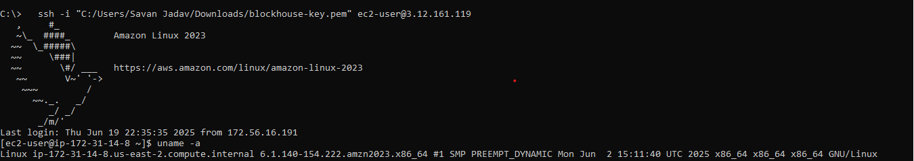
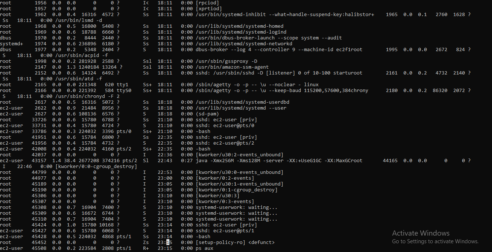
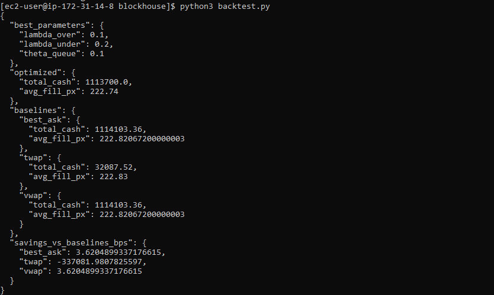

# Blockhouse Quant Developer Work Trial

## Deliverables
- `kafka_producer.py`: Streams l1_day.csv to Kafka
- `backtest.py`: Consumes stream, applies allocator logic
- `README.md`: Approach, tuning logic, EC2 setup
- `results.png/pdf` (optional): Plot of cumulative execution cost

## Setup Instructions

### Requirements
- Python 3.8+
- pandas, numpy
- kafka-python
- Kafka & Zookeeper (local or EC2)

### Installation
```bash
pip install pandas numpy kafka-python
```

### Running Kafka Producer
```bash
python kafka_producer.py
```

### Running Backtest
```bash
python backtest.py
```

## EC2 Deployment

### 1. Launch EC2 Instance
1. Launch a t3.micro instance with Amazon Linux 2023
2. Configure Security Group:
   - Allow SSH (port 22) from your IP
   - Allow TCP 2181 (Zookeeper) from your IP
   - Allow TCP 9092 (Kafka) from your IP

### 2. Connect and Setup Environment
```bash
# Connect to your instance
ssh -i your-key.pem ec2-user@your-instance-ip

# Update system
sudo yum update -y

# Install Java 11
sudo yum install java-11-amazon-corretto -y

# Install Python and pip
sudo yum install python3 python3-pip -y

# Create project directory
mkdir ~/blockhouse
cd ~/blockhouse

# Install Python dependencies
pip3 install pandas numpy kafka-python
```

### 3. Install and Configure Kafka
```bash
# Download and extract Kafka
wget https://downloads.apache.org/kafka/3.9.1/kafka_2.13-3.9.1.tgz
tar -xzf kafka_2.13-3.9.1.tgz
cd kafka_2.13-3.9.1

# Configure Kafka for t3.micro memory constraints
echo 'export KAFKA_HEAP_OPTS="-Xmx256M -Xms128M"' > ~/kafka_env.sh
source ~/kafka_env.sh

# Edit server.properties
sed -i 's/#listeners=PLAINTEXT:\/\/:9092/listeners=PLAINTEXT:\/\/0.0.0.0:9092/' config/server.properties
sed -i 's/#advertised.listeners=PLAINTEXT:\/\/your.host.name:9092/advertised.listeners=PLAINTEXT:\/\/'"$(curl -s http://169.254.169.254/latest/meta-data/public-ipv4)"':9092/' config/server.properties
```

### 4. Start Services
```bash
# Start Zookeeper (in background)
bin/zookeeper-server-start.sh -daemon config/zookeeper.properties

# Start Kafka (in background)
bin/kafka-server-start.sh -daemon config/server.properties

# Create topic
bin/kafka-topics.sh --create --topic mock_l1_stream --bootstrap-server localhost:9092 --partitions 1 --replication-factor 1
```

### 5. Deploy Application
```bash
# In a new terminal, copy files to EC2
scp -i your-key.pem kafka_producer.py backtest.py l1_day.csv ec2-user@your-instance-ip:~/blockhouse/

# SSH into EC2 again
ssh -i your-key.pem ec2-user@your-instance-ip

# Run producer
cd ~/blockhouse
python3 kafka_producer.py &

# Run backtest in another terminal
python3 backtest.py
```

### 6. Monitoring and Maintenance
```bash
# Check if Kafka is running
ps aux | grep kafka

# Check if Zookeeper is running
ps aux | grep zookeeper

# View Kafka logs
tail -f ~/kafka_2.13-3.9.1/logs/server.log

# View Zookeeper logs
tail -f ~/kafka_2.13-3.9.1/logs/zookeeper.out
```

### 7. Cleanup
```bash
# Stop Kafka
~/kafka_2.13-3.9.1/bin/kafka-server-stop.sh

# Stop Zookeeper
~/kafka_2.13-3.9.1/bin/zookeeper-server-stop.sh

# Terminate EC2 instance when done
```

### Troubleshooting
1. If Kafka fails to start, check logs in `~/kafka_2.13-3.9.1/logs/`
2. Ensure enough disk space: `df -h`
3. Monitor memory usage: `free -m`
4. Check ports are open: `netstat -plnt`

## EC2 Deployment Screenshots

### System Information (`uname -a`)


### Running Processes (Kafka, Zookeeper, Backtest)


### Final JSON Output


